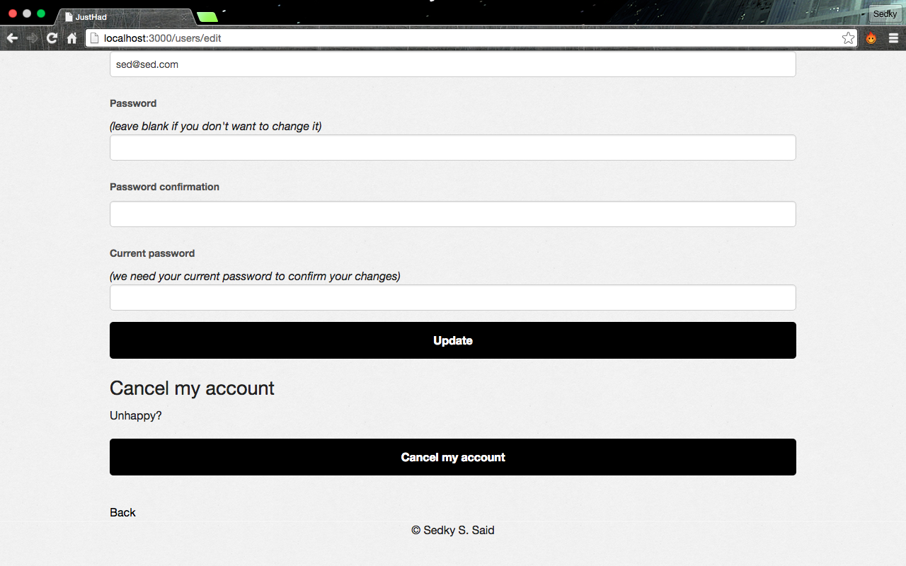

# Just Had

## WDI-LDN-16 - Project 2

### A Scocial Networking App for Foodies! 

[Just Had](https://just-had.herokuapp.com/)
####Overview
Just Had grew out of a desire to know what and where people like to eat. It is a place to connect with other like minded people. 
	
####The Approach/How it works
When a user visits the site they log in.

The user is taken to their Suggestion page, which lists all of their previous suggestions.

If they click on one of their suggestions, they can see suggestions made by other users nearby.

A user can add a suggestion.

A user can see all the suggestions made.

When a user is finished they sign out.

If a user so choose, their may update or delete their account.

####The Build
Just Had started with an idea and an ERD. Then I designed a high fidelity mock up.

The app was built using:

* Rails 4, Foundation 5, HTML 5, SCSS and jQuery.
* It features gems that allow for geolocating and image uploading.

####Challenges
I found the biggest challenge was being able to add more features to this version. 

	
	